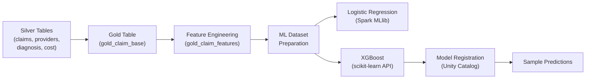
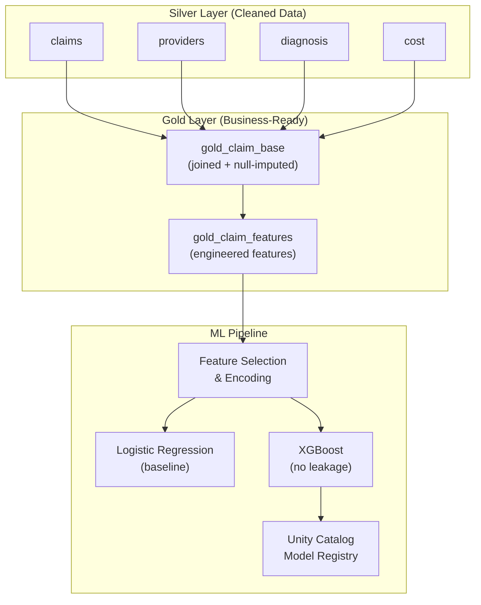

# Denial Prediction Model Notebook

## Overview

This notebook implements an **end-to-end ML pipeline for predicting insurance claim denials** on Databricks. It follows a **Medallion Architecture** (Silver → Gold → ML) pattern, building a binary classification model that predicts whether a healthcare claim will be denied (`denial_flag = 1`) or approved (`denial_flag = 0`).

### Pipeline at a Glance



---

## Cell-by-Cell Breakdown

---

### Cell 1 — Install Dependencies

```python
!pip install xgboost
%restart_python
```

**What:** Installs XGBoost (not pre-installed on all Databricks runtimes) and restarts the Python interpreter so the new package is importable.

**Why `%restart_python` instead of just importing?** Databricks caches the module namespace. After a `pip install`, the kernel may not find the new package without a restart. This is a Databricks-specific magic command (not standard Jupyter).

---

### Cell 2 — Global Configuration

```python
from pyspark.sql.functions import col, avg
import numpy as np

import os
os.environ["MLFLOW_DFS_TMP"] = "/Volumes/main/models/model"

CATALOG = "main"
SCHEMA  = "synthetic"
```

**What:**
- Imports PySpark functions and NumPy.
- Sets `MLFLOW_DFS_TMP` — tells MLflow where to stage temporary model artifacts on Unity Catalog Volumes (DBFS or cloud storage).
- Defines `CATALOG` and `SCHEMA` as constants for the Unity Catalog namespace (`main.synthetic`).

**Why constants?** Avoids hard-coding catalog/schema strings throughout the notebook. If you move to a different catalog (e.g., `dev`), you change one line.

**Why `os.environ` for MLflow?** MLflow on Databricks needs a writable path to serialize large model artifacts before logging. Without this, it defaults to DBFS root, which may not exist or have permissions in Unity Catalog-enabled workspaces.

---

### Cell 4 — Load Silver Tables

```python
claims    = spark.table(f"{CATALOG}.{SCHEMA}.claims")
providers = spark.table(f"{CATALOG}.{SCHEMA}.providers")
diagnosis = spark.table(f"{CATALOG}.{SCHEMA}.diagnosis")
cost      = spark.table(f"{CATALOG}.{SCHEMA}.cost")

print("claims:", claims.count())
print("providers:", providers.count())
print("diagnosis:", diagnosis.count())
print("cost:", cost.count())
```

**What:** Loads four Delta tables from the Silver layer of Unity Catalog into Spark DataFrames and prints row counts.

**The four tables:**

| Table | Purpose | Likely Join Key |
|-------|---------|-----------------|
| `claims` | Core claims data (billed amount, patient, provider, procedure, denial flag) | `provider_id`, `diagnosis_code`, `procedure_code` |
| `providers` | Doctor/provider metadata (specialty, location, name) | `provider_id` |
| `diagnosis` | Diagnosis lookup (category, severity) | `diagnosis_code` |
| `cost` | Procedure cost benchmarks (average/expected cost by region) | `procedure_code` |

**Why `spark.table()` instead of `spark.read.format("delta").load(path)`?** `spark.table()` uses the Unity Catalog metastore, which provides governance, lineage tracking, and access control. Path-based reads bypass all of that.

---

### Cell 6 — Build Gold Table via Joins

```python
from pyspark.sql.functions import avg

cost_agg = cost.groupBy("procedure_code").agg(
    avg("average_cost").alias("average_cost"),
    avg("expected_cost").alias("expected_cost")
)

gold_claim_base = claims.join(providers, on="provider_id", how="left")
gold_claim_base = gold_claim_base.join(diagnosis, on="diagnosis_code", how="left")
gold_claim_base = gold_claim_base.join(cost_agg, on="procedure_code", how="left")
```

**What:**
1. **Aggregates `cost`** by `procedure_code` — averages the cost across regions so each procedure has one row.
2. **Left-joins** claims → providers → diagnosis → cost_agg to create a wide, denormalized Gold table.

**Why aggregate cost first?** The `cost` table likely has multiple rows per `procedure_code` (one per region). A direct join would **fan out** (multiply) claim rows. Aggregating first ensures a 1:1 join ratio.

**Why LEFT joins (not INNER)?** Preserves all claims even if a provider, diagnosis, or cost record is missing. An inner join would silently drop claims — very dangerous for an ML model that needs to learn from all cases, including edge cases with missing data.

---

### Cell 8 — Null Audit

```python
from pyspark.sql.functions import when, isnull, count as spark_count

null_counts = gold_claim_base.select([
    spark_count(when(isnull(c), c)).alias(c)
    for c in gold_claim_base.columns
])
null_counts.show()
```

**What:** Counts NULLs per column across the entire Gold table. This is a diagnostic step — the output tells you which columns need imputation.

---

### Cell 9 — Null Imputation

```python
gold_claim_base = gold_claim_base.fillna({
    "category"      : "Unknown",
    "severity"      : "Unknown",
    "average_cost"  : 0.0,
    "expected_cost" : 0.0,
    "specialty"     : "Unknown",
    "location"      : "Unknown",
    "doctor_name"   : "Unknown"
})
```

**What:** Fills NULLs with sensible defaults — `"Unknown"` for categorical columns, `0.0` for cost columns.

**Why "Unknown" instead of mode (most frequent value)?** Mode imputation would inject bias — the model would falsely associate the most common category with claims that actually had missing data. `"Unknown"` creates an honest separate category that the model can learn to handle.

**Why `0.0` for costs instead of median?** This is a **design choice worth questioning.** Setting cost to 0 means "we don't know the cost," but the model might interpret it as "this procedure is free," which could skew the `billed_vs_avg_cost` ratio to infinity. A median or mean imputation would be less distorting. However, since `average_cost` appears in a denominator later (Cell 13), a `+1` offset is added there to prevent division by zero, partially mitigating this.

---

### Cell 11 — Persist Gold Table

```python
gold_claim_base.write \
    .format("delta") \
    .mode("overwrite") \
    .saveAsTable(f"{CATALOG}.gold.gold_claim_base")
```

**What:** Writes the joined, null-imputed table to Unity Catalog as a managed Delta table in the `gold` schema.

**Why `overwrite`?** This notebook is designed for re-runability. Overwrite ensures idempotency — running it twice doesn't create duplicates.

**Why save before feature engineering?** Separates concerns. The Gold base table is a reusable asset — other notebooks or dashboards can query it without re-running the joins. Feature engineering is model-specific and layered on top.

---

### Cell 13 — Cost-Based Features

```python
gold_claim_features = gold_claim_base.withColumn(
    "billed_vs_avg_cost", round(col("billed_amount") / (col("average_cost") + 1), 2)
).withColumn(
    "high_cost_flag", when(col("billed_amount") > col("average_cost"), 1).otherwise(0)
)
```

**What:** Creates two features:

| Feature | Logic | Intuition |
|---------|-------|-----------|
| `billed_vs_avg_cost` | `billed_amount / (average_cost + 1)` | Ratio > 1 means the provider billed more than the procedure typically costs. Higher ratio = higher denial risk. |
| `high_cost_flag` | `1 if billed > average_cost else 0` | Binary flag for "over-billed" claims. |

**Why `+ 1` in the denominator?** Prevents division-by-zero when `average_cost` is 0 (from null imputation). This is Laplace smoothing for ratios.

**Why not log-transform the ratio?** The ratio can be heavily right-skewed (e.g., a \$50,000 bill on a \$1,000 procedure = 50x). A `log(billed_vs_avg_cost)` would compress outliers and often improves model performance. This is a possible improvement.

---

### Cell 14 — Provider-Level Features

```python
provider_stats = gold_claim_base.groupBy("provider_id").agg(
    spark_count("claim_id").alias("provider_claim_count"),
    round(spark_sum("denial_flag") / spark_count("claim_id"), 4).alias("provider_risk_score")
)
gold_claim_features = gold_claim_features.join(provider_stats, on="provider_id", how="left")
```

**What:** For each provider, computes:
- `provider_claim_count` — total claims submitted by that provider
- `provider_risk_score` — **denial rate** (denied claims / total claims)

<!-- > [!WARNING]
> **Data Leakage!** `provider_risk_score` is calculated using `denial_flag` from the entire dataset, including the test set. This means the model gets to "peek" at future denial outcomes during training. This is addressed later in Cell 24 when XGBoost is retrained without these features. -->
> 
---

### Cell 15 — Diagnosis & Patient Features

```python
diagnosis_stats = gold_claim_base.groupBy("diagnosis_code").agg(
    spark_count("claim_id").alias("diagnosis_count")
)
claim_freq = gold_claim_base.groupBy("patient_id").agg(
    spark_count("claim_id").alias("claim_frequency")
)
gold_claim_features = gold_claim_features.join(diagnosis_stats, on="diagnosis_code", how="left")
gold_claim_features = gold_claim_features.join(claim_freq, on="patient_id", how="left")
```

**What:**
- `diagnosis_count` — how many claims reference each diagnosis code (popularity of diagnosis)
- `claim_frequency` — how many claims each patient has filed (frequent filers may be flagged)

**Why these features?** 
- Rare diagnoses might be more scrutinized → higher denial.
- Patients with very high claim frequency might trigger fraud detection → higher denial.

---

### Cell 16 — Severity Encoding

```python
gold_claim_features = gold_claim_features.withColumn(
    "severity_score",
    when(col("severity") == "High", 3)
    .when(col("severity") == "Medium", 2)
    .when(col("severity") == "Low", 1)
    .otherwise(0)  # "Unknown"
)
```

**What:** Ordinal-encodes severity: High=3, Medium=2, Low=1, Unknown=0.

**Why ordinal instead of one-hot?** Severity has a natural order (Low < Medium < High). Ordinal encoding preserves this ranking. One-hot encoding would lose the ordinal relationship and add extra dimensions.

**Why is "Unknown" = 0?** It's treated as "lower than Low." An alternative would be to set it to the median (2) or use a separate flag. Setting it to 0 is conservative — it assumes unknown severity is not a high-risk indicator.

---

### Cell 17 — Save Feature Table

```python
gold_claim_features.write \
    .format("delta") \
    .mode("overwrite") \
    .saveAsTable(f"{CATALOG}.gold.gold_claim_features")
```

**What:** Persists the feature-enriched table as a second Gold table. This table can be reused for different models or analysis.

---

### Cell 19 — Select ML Columns & Final Null Fill

```python
ml_cols = [
    "billed_amount", "billed_vs_avg_cost", "high_cost_flag",
    "provider_claim_count", "provider_risk_score",
    "diagnosis_count", "claim_frequency", "severity_score",
    "specialty", "category", "location",
    "denial_flag"  # target
]
ml_df = gold_claim_features.select(ml_cols)

ml_df = ml_df.fillna({
    "diagnosis_count": 0, "provider_risk_score": 0.0,
    "billed_vs_avg_cost": 0.0, "claim_frequency": 0
})
```

**What:** Selects only model-relevant columns (drops IDs, names, raw codes) and fills any remaining NULLs introduced by the left joins.

**Why drop IDs?** `claim_id`, `patient_id`, `provider_id` are identifiers with no predictive meaning — including them would cause overfitting (the model memorizes IDs instead of learning patterns).

---

### Cell 20 — Categorical Encoding (dense_rank)

```python
cat_cols = ["specialty", "category", "location"]
for c in cat_cols:
    window = Window.orderBy(c)
    ml_df = ml_df.withColumn(c + "_idx", dense_rank().over(window) - 1)
ml_df = ml_df.drop(*cat_cols)
```

**What:** Converts string categoricals into integer indices using `dense_rank()` (alphabetical ordering, 0-indexed).

**Why `dense_rank` instead of `StringIndexer`?** 
- `StringIndexer` (Spark MLlib) orders by frequency (most common = 0). `dense_rank` orders alphabetically. Both are arbitrary for tree-based models.
- `dense_rank` is a pure SQL operation — simpler and doesn't require fitting a separate transformer.

**Why not one-hot encoding?** For tree-based models (XGBoost, Random Forest), integer encoding works fine because trees can split on any value. One-hot encoding would explode dimensionality needlessly. However, for Logistic Regression (Cell 23), integer encoding implies a false ordinal relationship (e.g., "Cardiology" < "Neurology" numerically), which can hurt linear models.

> [!NOTE]
> This is a **trade-off**: the encoding is optimal for XGBoost but sub-optimal for Logistic Regression. Ideally, you'd use one-hot for LR and integer for XGBoost.

---

### Cell 21 — Vector Assembly & Train/Test Split

```python
assembler = VectorAssembler(inputCols=feature_cols, outputCol="features", handleInvalid="skip")
ml_df_vectorized = assembler.transform(ml_df)
final_df = ml_df_vectorized.select("features", "denial_flag")
train_df, test_df = final_df.randomSplit([0.7, 0.3], seed=42)
```

**What:**
1. **VectorAssembler** — combines all 11 feature columns into a single dense vector column called `features` (required by Spark MLlib).
2. **70/30 train/test split** with a fixed seed for reproducibility.

**Why `handleInvalid="skip"`?** Drops rows with NaN/NULL in any feature column rather than crashing. A safety net after the fillna steps.

**Why not a validation set (train/val/test)?** For a simple comparison of two models, train/test is sufficient. A validation set or cross-validation would be better for hyperparameter tuning, but this notebook does minimal tuning.

---

### Cell 23 — Logistic Regression with MLflow Tracking

```python
mlflow.set_experiment("/Users/deepeshvcd6273@gmail.com/claim_denial_prediction")

with mlflow.start_run(run_name="logistic_regression"):
    lr = LogisticRegression(featuresCol="features", labelCol="denial_flag", maxIter=100)
    lr_model = lr.fit(train_df)
    predictions = lr_model.transform(test_df)
```

**What:** Trains a **Spark MLlib Logistic Regression** and logs everything to MLflow:
- **Parameters:** model type, maxIter
- **Metrics:** ROC-AUC, accuracy, weighted precision, weighted recall
- **Artifact:** the serialized Spark model

**Why Logistic Regression first?** It's the **baseline model**. Always start with a simple, interpretable model before trying complex ones. If LR gets 95% accuracy, you don't need XGBoost. If it gets 60%, you know there's room for improvement.

**Why `maxIter=100`?** Default is 100 in Spark. It's the maximum number of optimizer iterations (L-BFGS). For most datasets, convergence happens well before 100.

**Why MLflow?** Provides experiment tracking (compare runs), model versioning, and reproducibility. Essential for production ML workflows on Databricks.

**Why `weightedPrecision` / `weightedRecall`?** If the classes are imbalanced (e.g., 90% approved, 10% denied), weighted metrics account for class sizes. Unweighted metrics would be dominated by the majority class.

---

### Cell 24 — XGBoost (Without Leakage Features)

```python
feature_cols_clean = [
    "billed_amount", "billed_vs_avg_cost", "high_cost_flag",
    "severity_score", "specialty_idx", "category_idx", "location_idx"
]
# ... rebuilds features, converts to Pandas, trains XGBoost
```

**What:** This is the **critical cell** — it:

1. **Removes leakage features**: `provider_claim_count`, `provider_risk_score`, `diagnosis_count`, `claim_frequency` — all computed from the full dataset including the target variable.
2. **Converts Spark DataFrame to Pandas** (XGBoost's scikit-learn API needs NumPy arrays).
3. **Trains XGBoost** with `n_estimators=100, max_depth=6, learning_rate=0.1`.
4. **Evaluates** using scikit-learn metrics and logs to MLflow.

**Why remove those 4 features?**

| Dropped Feature | Leakage Reason |
|----------------|----------------|
| `provider_risk_score` | Directly derived from `denial_flag` (the target!) |
| `provider_claim_count` | Correlated with risk score computation |
| `diagnosis_count` | Aggregate over entire dataset including test |
| `claim_frequency` | Patient-level aggregate over entire dataset |

These features would give artificially inflated accuracy because they encode information about the target. In production, you wouldn't have future denial outcomes when making a prediction.

**Why XGBoost over Random Forest, LightGBM, or Neural Networks?**
- **vs Random Forest:** XGBoost typically outperforms RF due to boosting (sequential error correction) vs bagging (parallel averaging).
- **vs LightGBM:** Both are excellent. XGBoost is more widely used and better supported on Databricks.
- **vs Neural Networks:** Overkill for tabular data with ~10 features. Gradient boosting consistently beats NNs on structured/tabular data (see benchmarks from Grinsztajn et al., 2022).

**Why convert to Pandas?** XGBoost's scikit-learn wrapper doesn't accept Spark DataFrames. The alternative — `xgboost.spark.SparkXGBClassifier` — would avoid the conversion but has less mature API support.

---

### Cell 25 — Section Header: `### 9. Register Model to MLFlow`

---

### Cell 26 — Model Registration to Unity Catalog

```python
signature = infer_signature(input_example, output_example)

with mlflow.start_run(run_name="xgboost_final") as run:
    mlflow.xgboost.log_model(xgb_clean, "xgb_model",
                              signature=signature, input_example=input_example)
    run_id = run.info.run_id

registered_model = mlflow.register_model(
    model_uri=f"runs:/{run_id}/xgb_model",
    name=f"{CATALOG}.{SCHEMA}.claim_denial_model"
)
```

**What:**
1. **Infers model signature** — defines expected input/output schema (feature names, types, shapes).
2. **Logs the final XGBoost model** to MLflow with signature and example.
3. **Registers the model** in Unity Catalog under `main.synthetic.claim_denial_model`.

**Why register?** Registration makes the model a first-class citizen in Unity Catalog:
- Versioned (v1, v2, ...) — rollback if new version is worse
- Governed — access control, lineage tracking
- Deployable — can be served via Databricks Model Serving with one click

**Why `infer_signature`?** Without a signature, model serving doesn't know the expected input schema and can't validate requests. The signature acts as a contract.

---

### Cell 28 — Sample Predictions

```python
test_claims = np.array([
    [15000.0, 2.5,  1, 3, 0, 4, 3],   # High risk
    [20000.0, 3.8,  1, 3, 0, 2, 4],   # High risk
    # ... 8 more examples
])

probs       = xgb_clean.predict_proba(test_claims)[:, 1]
predictions = xgb_clean.predict(test_claims)
```

**What:** Runs 10 hand-crafted test claims through the trained model and prints a formatted table showing:
- Denial probability
- Binary prediction (DENIED/APPROVED)
- Risk level (HIGH if prob ≥ 0.5, else LOW)

**The 7 features per claim** (in order): `billed_amount`, `billed_vs_avg_cost`, `high_cost_flag`, `severity_score`, `specialty_idx`, `category_idx`, `location_idx`.

**Why hand-crafted examples?** Serves as a **smoke test** — verifies the model produces sensible outputs for known scenarios (high-cost cardiology claims should be denied, low-cost general claims should be approved).

---

## Architecture Summary



---

## Critique & Potential Improvements

| Area | Issue | Suggestion |
|------|-------|------------|
| **Null imputation** | `average_cost = 0.0` distorts the billed-vs-cost ratio | Use median imputation or a separate "cost_missing" flag |
| **Encoding** | Integer encoding for LR is suboptimal | Use one-hot for LR, integer for XGBoost |
| **Leakage** | LR model (Cell 23) still uses leaky features | Should also retrain LR without leakage features for fair comparison |
| **Validation** | No cross-validation | Use `CrossValidator` or `KFold` for more robust estimates |
| **Class imbalance** | Not addressed | Consider SMOTE, class weights, or `scale_pos_weight` in XGBoost |
| **Hyperparameter tuning** | None performed | Use `Hyperopt` or `Optuna` (both integrate with MLflow on Databricks) |
| **Feature importance** | Not analyzed | Add `xgb_clean.feature_importances_` plot to understand what drives denials |
| **Temporal split** | `randomSplit` doesn't respect time | If claims have dates, split by time to avoid look-ahead bias |
